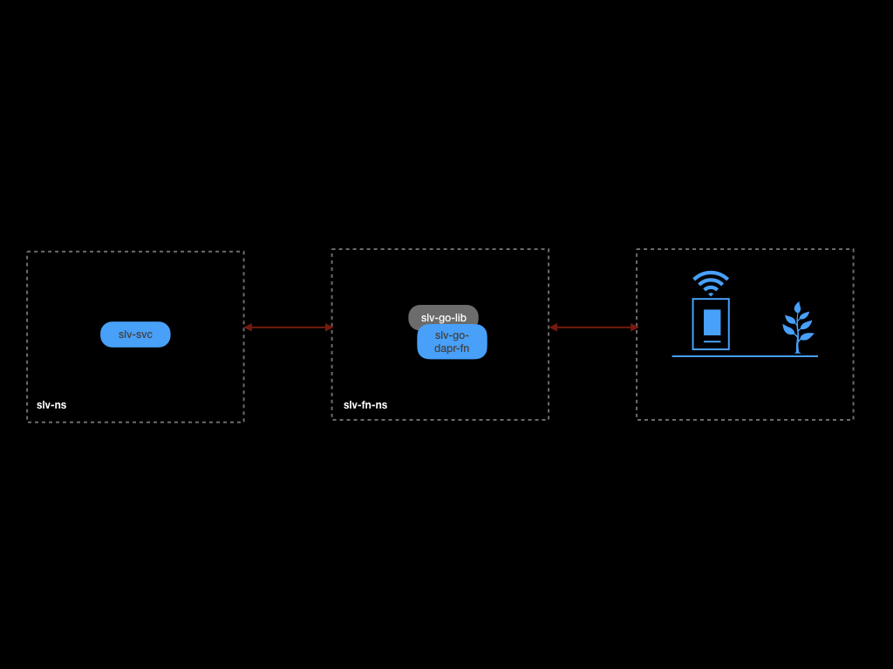

# slv-go-dapr-fn

### Goals
- Store the soil moisture level from an IoT sensor in a permissioned blockchain

### Overview

This repository contains the golang dapr function that acts as an intermediatory between an IoT sensor (which reports soil moisture level) and a permissioned blockchain. 

slv-go-dapr-fn exposes a simple REST that can be invoked by the sensor. The value provided by the sensor is committed to the ledger using the Serverless Ledger Variables golang library.

### Overview of Serverless Ledger Variables (SLV)

SLV provides a way for serverless functions to create and manage state. In addition to the usual properties such Type, Scope, Permissions; SLV provides -

- All writes to the state are performed when the Blockchain consensus is achieved.
- History of all changes to the state can be queried.

